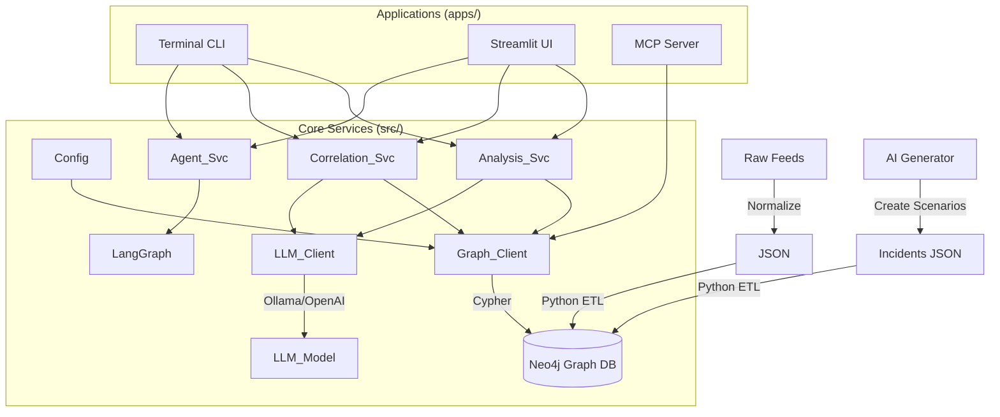

# 🛡️ Cyber Threat Ontology Intelligence (COIN)

**A Next-Gen Threat Intelligence Platform powered by Knowledge Graphs and Autonomous AI Agents.**

This project structures fragmented cyber threat data (IOCs, TTPs, CVEs) into a machine-readable **Knowledge Graph (Neo4j)**. By integrating **Graph Database** with **LLMs (via LangChain/LangGraph)**, it provides deep analysis, hidden correlation discovery, and an autonomous reasoning agent that answers complex security questions and simulates attack scenarios.

---

## ✨ Key Features

### 1. 🕸️ Graph-Based Threat Modeling
- **Property Graph Model**: Structures data into nodes and relationships (`:Incident`, `:Malware`, `:ThreatGroup`, `:Vulnerability`, `:AttackStep`) using **Neo4j**.
- **Data Integration**: Ingests and normalizes data from disparate sources:
  - **MITRE ATT&CK** (Tactics & Techniques)
  - **CISA KEV** (Exploited Vulnerabilities)
  - **URLhaus** (Malicious URLs/Payloads)

### 2. 🎞️ AI-Driven Scenario Generation & Explorer
- **Synthetic Incident Generation**: Uses LLMs to generate realistic cyber attack scenarios based on real-world threat intelligence.
- **Interactive Graph Explorer**: A "Cyberpunk" styled dynamic graph interface to explore:
  - **Full Kill Chain**: Visualize the step-by-step attack flow.
  - **Recursive Expansion**: Click on artifacts to uncover related incidents and threat actors.
  - **Timeline Analysis**: Detailed chronological breakdown of the attack.

### 3. 🧠 Autonomous Reasoning Agent
- **LangGraph Integration**: Uses ReAct (Reason+Act) pattern to autonomously inspect the schema, write **Cypher** queries, and self-correct errors.
- **Context-Aware**: Remembers conversation history and context using optimized LLM context windows.

### 4. 🔍 Deep & Correlation Analysis
- **Entity Profiling**: Detailed analysis of specific Incidents or Malware using Graph Traversal.
- **Multi-hop Correlation**: Traces indirect relationships (e.g., "Do these two different IPs share a common attack technique or malware family?").

### 5. 🖥️ Multi-Interface Support
- **Streamlit UI**: A comprehensive web dashboard for visual analysis, agent interaction, and scenario exploration.
- **Interactive CLI**: A lightweight terminal interface for quick queries.
- **MCP Server**: Supports **Model Context Protocol**, allowing integration with AI clients like Claude Desktop.

---

## 🏗️ Architecture

The system follows a modular architecture separating the Core Logic, Services, and Application Layers.



---

## 📂 Directory Structure

```text
cyber-ontology/
├── apps/                 # Application Entry Points
│   ├── cli/              # Interactive Command-Line Interface
│   ├── ui/               # Streamlit Web Dashboard
│   │   └── pages/        # Deep Analysis, Correlation, Scenario Explorer
│   └── mcp/              # Model Context Protocol Server
├── src/                  # Core Business Logic
│   ├── core/             # Configuration, Neo4j Client & LLM Wrappers
│   └── services/         # Analysis, Correlation, Agent Logic
├── data/                 # Data Storage
│   ├── raw/              # Raw downloads
│   ├── generated/        # AI-generated incident scenarios
│   └── processed/        # Normalized JSON files for ETL
├── scripts/              # Setup & Data Processing Scripts
│   ├── etl/              # Neo4j Ingestion Scripts
│   └── setup/            # Initial setup scripts
├── .streamlit/           # Streamlit Theme Configuration
├── .env                  # Environment Variables
├── requirements.txt      # Python Dependencies
└── README.md             # Documentation
```

---

## 🚀 Getting Started

### Prerequisites

* **Python 3.10+**
* **Docker** (for running Neo4j container)
* **Ollama** (for local LLM) or OpenAI API Key

### 1. Environment Setup

```bash
# Clone the repository
git clone [https://github.com/your-username/cyber-ontology.git](https://github.com/your-username/cyber-ontology.git)
cd cyber-ontology

# Create virtual environment
python -m venv .venv
source .venv/bin/activate  # Windows: .venv\Scripts\activate

# Install dependencies
pip install -r requirements.txt
```

### 2. Configuration (`.env`)

Create a `.env` file in the project root:

```ini
# --- Neo4j Database Settings ---
NEO4J_URI=bolt://localhost:7687
NEO4J_USERNAME=neo4j
NEO4J_PASSWORD=your_password

# --- LLM Settings (Choose 'ollama' or 'openai') ---
LLM_PROVIDER=ollama

# Ollama Config
OLLAMA_BASE_URL=http://localhost:11434
OLLAMA_MODEL=llama3.1
OLLAMA_NUM_CTX=16384

# OpenAI Config (Optional)
# OPENAI_API_KEY=sk-proj-...
# OPENAI_MODEL=gpt-4o
```

### 3. Database Setup (Neo4j)

1. Run Neo4j using Docker:

```bash
docker run -d \
  --name neo4j-coin \
  -p 7474:7474 -p 7687:7687 \
  -e NEO4J_AUTH=neo4j/your_password \
  neo4j:latest
```
2. Run Neo4j using `docker-compose`:

```bash
# On the project root directory
docker-compose up -d
```


Access the Neo4j Browser at `http://localhost:7474`.

### 4. Data Ingestion

```bash
# 1. Download & Normalize Raw Data
python scripts/setup/download_feeds.py

# 2. Generate Synthetic Incidents (Optional)
python scripts/etl/generate_incidents.py

# 3. Load Data into Neo4j
python scripts/etl/process_incidents.py
# (Run other ETL scripts as needed for MITRE/CISA data)

```

---

## 🖥️ Usage

### 1. Streamlit Web Dashboard (Recommended)

The most comprehensive interface with visualizations.

```bash
streamlit run apps/ui/Home.py
```

* **Deep Analysis**: Profile specific entities.
* **Correlation**: Find hidden links between artifacts.
* **Smart Agent**: Chat with the autonomous AI agent (Text-to-Cypher).
* **Scenario Explorer**: Interactive graph visualization of attack kill chains.

### 2. Interactive CLI

A fast, lightweight terminal tool.<br>
Implemented the first 3 functions.(Deep Analysis, Correlation, Chatbot)

```bash
python apps/cli/main.py
```

---

## Roadmap

* [x] Migration from Fuseki (RDF) to Neo4j (Property Graph)
* [x] Synthetic Incident Generation Pipeline
* [x] Interactive Scenario Explorer (Streamlit-Agraph)
* [x] Autonomous Agent (Text-to-Cypher)
* [ ] **Unstructured Data Processing (PDF/HTML Reports to Graph)**
* [ ] Automated TTP mapping from CTI reports
* [ ] Time-series analysis for campaign tracking