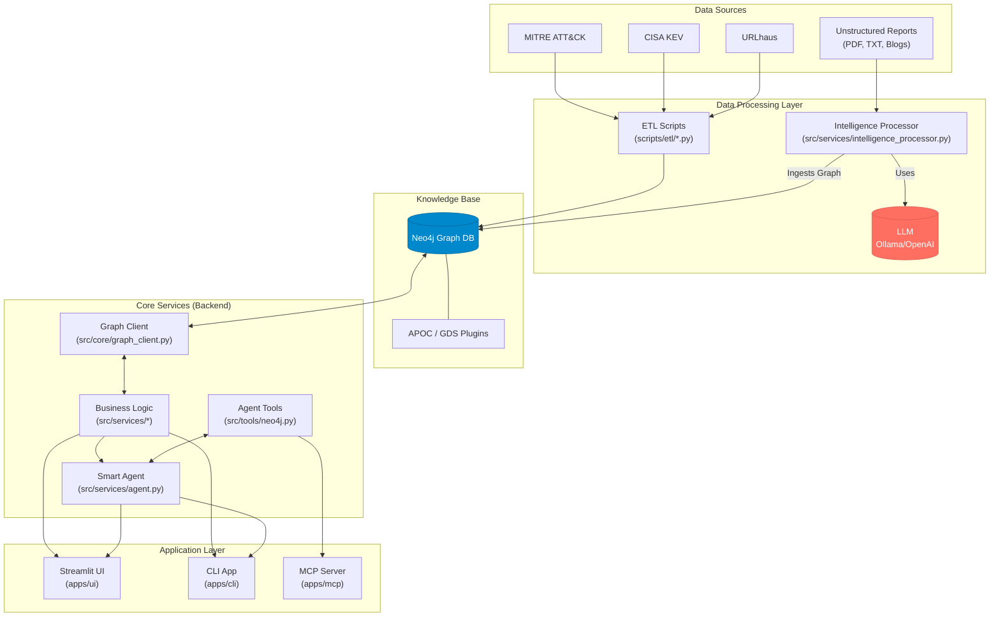

# 🛡️ Cyber Ontology INtelligence (COIN)

**A Next-Gen Threat Intelligence Platform powered by Knowledge Graphs and Autonomous AI Agents.**

COIN is a platform that transforms fragmented and unstructured cyber threat data into a machine-readable **Knowledge Graph (Neo4j)**. It bridges the gap between raw text reports and actionable intelligence by using **LLMs (via LangGraph)** to extract entities, map attack flows, and provide an autonomous reasoning agent for complex security queries.

---

## ✨ Key Features

1.  **Deep Analysis**: Performs in-depth profiling of specific entities like Threat Groups, Malware, and Vulnerabilities, generating AI-powered reports based on graph data.
2.  **Correlation**: Traces hidden connections between disparate IoCs (IPs, Hashes, URLs) to identify the threat actors or campaigns behind them using Graph algorithms.
3.  **Graph Analysis (Scenario Explorer)**: Visually explores attack scenarios (Incidents) step-by-step, tracking the kill chain from initial access to final impact.
4.  **Ontology Extractor**: Automatically structures unstructured CTI reports (text) into a formal ontology (Incident -> Step -> Entity) using LLMs, ready for graph ingestion.
5.  **Smart Agent (AI Analyst)**: A proactive AI analyst that understands natural language (**Korean/English**), queries the knowledge graph in real-time, and provides context-aware answers about complex threat relationships.

---

## 🏗️ Architecture

The system follows a modular architecture separating the Data, Backend, and Application layers.



---

## 📂 Directory Structure

```text
cyber-ontology/
├── apps/                 # Application Entry Points
│   ├── cli/              # Command Line Interface
│   ├── mcp/              # MCP Tool Server (for Desktop LLMs like Claude)
│   └── ui/               # Streamlit Web Dashboard
│       ├── Home.py       # System Dashboard & Metrics
│       └── pages/        # Interactive Analysis Pages
│           ├── 1_Deep_Analysis.py
│           ├── 2_Correlation.py
│           ├── 3_Graph_Analysis.py
│           ├── 4_Ontology_Extractor.py
│           └── 5_Smart_Agent.py
├── src/                  # Core Source Code
│   ├── core/             # Configuration, Database Clients, Schemas, Prompts
│   ├── services/         # Core Logic (Analysis, Correlation, Extraction, Agent)
│   ├── tools/            # LangChain/LangGraph Tools for Agent
│   └── utils/            # Helper utilities (Logger, etc.)
├── scripts/              # Automation Scripts
│   ├── etl/              # Data Processing Pipelines
│   │   ├── preprocess_mitre.py
│   │   ├── preprocess_kev.py
│   │   ├── preprocess_urlhaus.py
│   │   └── process_incidents.py
│   ├── setup/            # Initialization Scripts
│   │   ├── download_cisa_kev.sh
│   │   ├── download_mitre_attack.sh
│   │   ├── download_urlhaus_online_csv.sh
│   │   ├── generate_incidents.py
│   │   └── init_db.py
│   ├── debug/            # Diagnostic scripts
│   └── setup_pipeline.sh # Master Master script for full setup
├── data/                 # Data storage (Raw/Processed/Generated)
├── schema/               # Neo4j Cypher Schema & Seed files
├── plugins/              # Neo4j Plugins (APOC, GDS)
├── docker-compose.yml    # Neo4j Container Configuration
├── requirements.txt      # Python Dependencies
├── test_agent.py         # Agent functional test
└── test_backend.py       # Backend service test
```

---

## 🚀 Getting Started

### 1. Prerequisites

*   **Python 3.10+** (Recommend using `conda` or `venv`)
*   **Docker & Docker Compose** (For Neo4j Graph DB)
*   **Ollama** (Local LLM) or **OpenAI API Key** (Cloud LLM)

### 2. Installation

1. Clone the repository:
   ```bash
   git clone https://github.com/seonwookim92/Cyber-Ontology-INtelligence.git
   cd Cyber-Ontology-INtelligence
   ```

2. Setup virtual environment:
   ```bash
   python -m venv .venv
   source .venv/bin/activate  # On Windows: .venv\Scripts\activate
   pip install -r requirements.txt
   ```

### 3. Configuration

Copy `.env.example` to `.env` and fill in your credentials.

```bash
cp .env.example .env
```

Key environment variables:
```ini
# Neo4j
NEO4J_URI=bolt://localhost:7687
NEO4J_USER=neo4j
NEO4J_PASSWORD=password1234!

# LLM Selection
LLM_PROVIDER=ollama  # choices: [ollama, openai]
OLLAMA_MODEL=llama3.1
OPENAI_API_KEY=sk-... # required if LLM_PROVIDER is openai
```

### 4. Running the Pipeline

COIN requires a multi-step data pipeline to populate the Knowledge Graph. We provide a master script to automate this:

1. Start Neo4j:
   ```bash
   docker-compose up -d
   ```

2. Run the Full Setup Pipeline:
   ```bash
   chmod +x scripts/setup_pipeline.sh
   ./scripts/setup_pipeline.sh
   ```
   *This script will: Download MITRE/KEV/URLHaus data -> Preprocess to CSV -> Initialize Neo4j Schema -> Ingest Intelligence Base -> (Optionally) Generate AI attack scenarios.*

---

## 🖥️ Usage

### Web Dashboard (GUI) - **Recommended**

The unified dashboard provides access to all COIN features visually.

```bash
streamlit run apps/ui/Home.py
```

*   **Dashboad (Home)**: View system health (LLM/DB) and total intelligence metrics.
*   **Deep Analysis**: Profile groups like "Lazarus" or "APT28" and generate AI summaries.
*   **Correlation**: Input an IoC (like `http://103.212.69.118`) to find related malware or actors.
*   **Graph Analysis**: Explore chronological attack steps of realistic incidents.
*   **Ontology Extractor**: Paste a raw text report to extract a structured graph.
*   **Smart Agent**: Chat with the graph in **Korean** or **English**.

### CLI

```bash
python apps/cli/main.py
```

---

## 🧪 Testing

You can verify the backend connectivity and agent logic using the test scripts:

```bash
# Test Neo4j connection and basic services
python test_backend.py

# Test Smart Agent reasoning and Cypher tool usage
python test_agent.py
```

---

## 🛡️ Roadmap

* [x] Neo4j Property Graph Migration (STIX-based)
* [x] Autonomous Agent (LangGraph) with Cypher Tooling
* [x] Semantic Linking (KEV <-> MITRE mapping)
* [x] Streamlit Multi-Page UI
* [ ] Live Data Integration via Multi-Modal MCP Server
* [ ] Graph-based Fraud/Anomaly Detection Algorithms

---

**© 2026 Cyber Ontology Intelligence Project. Powered by Neo4j & LangGraph.**
