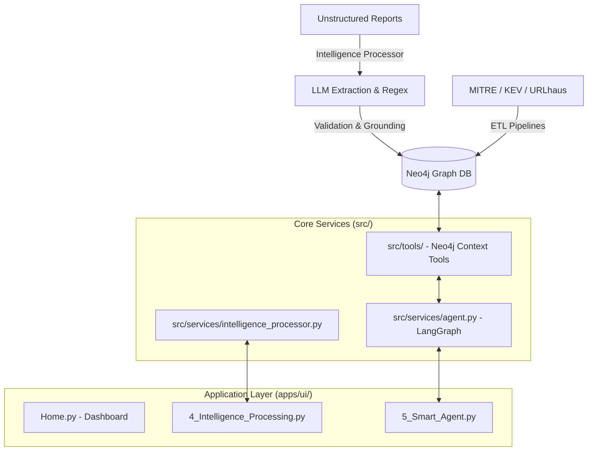

# 🛡️ Cyber Threat Ontology Intelligence (COIN)

**A Next-Gen Threat Intelligence Platform powered by Knowledge Graphs and Autonomous AI Agents.**

COIN is a platform that transforms fragmented and unstructured cyber threat data into a machine-readable **Knowledge Graph (Neo4j)**. It bridges the gap between raw text reports and actionable intelligence by using **LLMs (via LangGraph)** to extract entities, map attack flows, and provide an autonomous reasoning agent for complex security queries.

---

## ✨ Key Features

### 1. 🕸️ Graph-Based Threat Modeling

* **Incident-Centric Schema**: Organizes data into a hierarchical structure: `Intelligence (Report) -> AttackStep (Phase) -> Entity (IoC/Artifact)`.
* **Multi-Source Integration**: Automatically ingests and correlates data from:
* **MITRE ATT&CK** (Tactics & Techniques)
* **CISA KEV** (Known Exploited Vulnerabilities)
* **URLhaus** (Malicious URLs)


### 2. 📝 Unstructured Intelligence Processor (New!)

* **LLM-Powered Extraction**: Converts raw text (PDFs, blogs, CTI reports) into structured graph nodes.
* **Exhaustive IoC Recovery**: Combines LLM reasoning with Regex patterns to ensure no IP, Hash, or Wallet address is missed.
* **Entity Grounding**: Automatically normalizes entity names (e.g., matching "Remcos" to "RemcosRAT") using Fuzzy Search and LLM validation to prevent duplicate nodes.

### 3. 🧠 Smart Agent (AI Analyst)

* **Context-Aware Reasoning**: Unlike simple chatbots, the agent understands the "story" behind an IoC by tracing its path back to specific attack steps and incidents.
* **ReAct Pattern**: Autonomously decides which tools to use—schema inspection, context search, or direct Cypher queries—to answer complex questions.
* ** MCP Architecture (Internalized)**: Tools are modularized for easy extension to external providers like VirusTotal or Shodan.

### 4. 🎞️ Scenario Explorer

* **Kill Chain Visualization**: Uses `streamlit-agraph` to provide an interactive view of the attack flow.
* **Category Classification**: Distinguishes between actual **Incidents**, **Malware Analyses**, and **Threat Reports** with distinct visual styles.

---

## 🏗️ Architecture

The system follows a modular architecture separating Data Ingestion, Intelligence Processing, and AI Reasoning layers.



---

## 📂 Directory Structure

```text
cyber-ontology/
├── apps/                 # Application Entry Points
│   └── ui/               # Streamlit Web Dashboard
│       ├── Home.py       # System Dashboard & Navigation
│       └── pages/        # Analysis, Correlation, Processing, Smart Agent
├── src/                  # Core Business Logic
│   ├── core/             # Config, Neo4j Client, Pydantic Schemas
│   │   ├── repository/   # DB Ingestion Logic (Graph Repository)
│   │   └── schemas.py    # Data Models (IntelligenceReport, Entity)
│   ├── services/         # Business Logic (Processor, Agent)
│   └── tools/            # Modular LangChain Tools (Neo4j Context Search)
├── data/                 # Data Storage (Raw, Generated, Processed)
├── scripts/              # Setup & ETL Pipeline Scripts
└── requirements.txt      # Python Dependencies

```

---

## 🚀 Getting Started

### 1. Prerequisites

* **Python 3.10+**
* **Neo4j DB** (Docker recommended)
* **Ollama** (Local LLM) or **OpenAI API Key**

### 2. Environment Setup

```bash
git clone https://github.com/your-username/cyber-ontology.git
cd cyber-ontology
python -m venv .venv
source .venv/bin/activate
pip install -r requirements.txt
```

### 3. Neo4j Configuration

Update your `.env` file with Neo4j and LLM credentials:

```ini
NEO4J_URI=bolt://localhost:7687
NEO4J_USER=neo4j
NEO4J_PASSWORD=your_password
LLM_PROVIDER=openai  # or ollama
OPENAI_API_KEY=sk-...
```

### 4. Data Pipeline Execution (Recommended)

We provide a **master script** to handle the entire data pipeline in the correct order:

1. Initialize DB Constraints.
2. Download Raw Feeds (MITRE, KEV, URLHaus).
3. Build **Base Knowledge Graph**.
4. Generate **Synthetic Incidents** using LLM.
5. Ingest Incidents into the Graph.

```bash
# Give execution permission
chmod +x scripts/setup_pipeline.sh

# Run the full pipeline
./scripts/setup_pipeline.sh
```

> **Note:** Ensure your LLM provider (Ollama) is running before executing step 4, as incident generation requires LLM inference.

---

## 🖥️ Usage

### 📊 Running the Dashboard

```bash
streamlit run apps/ui/Home.py
```

1. **Ingest Data**: Go to `Intelligence Processing`, paste a raw CTI report, and click **Analyze**. Review the extracted graph and click **Ingest into Neo4j**.
2. **Analyze Context**: Use the `Scenario Explorer` to see how the attack unfolded step-by-step.
3. **Chat with Agent**: Open `Smart Agent` and ask: *"CVE-2025-55182에 대해 알려줘. 어떤 사건이랑 연관되어 있어?"*

---

## 🛡️ Roadmap

* [x] Migration to Neo4j Property Graph
* [x] **Unstructured CTI Report Processor (Text-to-Graph)**
* [x] **Context-Aware Autonomous Agent (Incident-Step-Entity Tracing)**
* [x] Entity Grounding & Normalization Logic
* [ ] Multi-Modal MCP Server (External Claude Desktop Support)
* [ ] Real-time Alerting via Graph Triggers
* [ ] Automated Mitre ATT&CK Mapping refinement

---

**© 2026 Cyber Ontology Intelligence Project. Powered by Neo4j & LangGraph.**