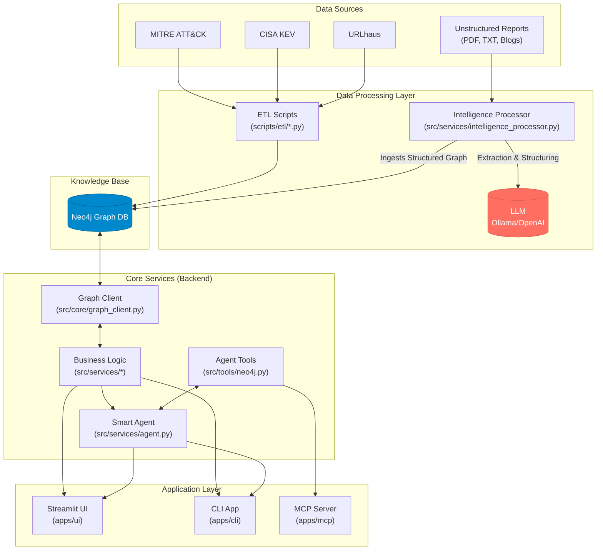

# 🛡️ Cyber Ontology INtelligence (COIN)

**A Next-Gen Threat Intelligence Platform powered by Knowledge Graphs and Autonomous AI Agents.**

COIN is a platform that transforms fragmented and unstructured cyber threat data into a machine-readable **Knowledge Graph (Neo4j)**. It bridges the gap between raw text reports and actionable intelligence by using **LLMs (via LangGraph)** to extract entities, map attack flows, and provide an autonomous reasoning agent for complex security queries.

---

## ✨ Key Features

1.  **Deep Analysis**: Performs in-depth profiling of specific entities like Threat Groups, Malware, and Vulnerabilities, generating AI-powered reports based on graph data.
2.  **Correlation**: Traces hidden connections between disparate IoCs (IPs, Hashes, URLs) to identify the threat actors or campaigns behind them.
3.  **Graph Analysis**: Visually explores attack scenarios (Incidents) step-by-step, tracking the kill chain from initial access to final impact.
4.  **Ontology Extractor**: Automatically structures unstructured CTI reports (text) into a formal ontology (Incident -> Step -> Entity) using LLMs and Regex, ready for graph ingestion.
5.  **Smart Agent (Chatbot)**: An AI analyst that understands natural language, queries the knowledge graph in real-time, and provides context-aware answers about complex threat relationships.

---

## 🏗️ Architecture

The system follows a modular architecture separating the Data, Backend, and Application layers. All components are designed to work together to provide a comprehensive intelligence lifecycle.



---

## 📂 Directory Structure

```text
cyber-ontology/
├── apps/                 # Application Entry Points
│   ├── cli/              # Command Line Interface
│   │   └── main.py
│   ├── mcp/              # MCP Tool Server
│   │   └── server_neo4j.py
│   └── ui/               # Streamlit Web Dashboard
│       ├── Home.py       # System Dashboard & Navigation
│       └── pages/        # UI Pages for each feature
│           ├── 1_Deep_Analysis.py
│           ├── 2_Correlation.py
│           ├── 3_Scenario_Explorer.py
│           ├── 4_Intelligence_Processing.py
│           └── 5_Smart_Agent.py
├── src/                  # Core Business Logic
│   ├── core/             # Config, DB Client, Pydantic Schemas
│   │   ├── config.py
│   │   ├── graph_client.py
│   │   ├── prompts.py
│   │   └── schemas.py
│   ├── services/         # Business Logic Services
│   │   ├── agent.py
│   │   ├── analysis.py
│   │   ├── correlation.py
│   │   └── intelligence_processor.py
│   └── tools/            # Modular LangChain Tools for the Agent
│       └── neo4j.py
├── data/                 # Data Storage
│   ├── raw/              # Original downloaded data
│   ├── seed/             # Seed data for scenario generation (Organizations)
│   ├── processed/        # Preprocessed data for Neo4j import
│   └── generated/        # AI-generated incident data
├── scripts/              # Automation & Setup Scripts
│   ├── etl/              # ETL pipelines (Raw -> Processed)
│   │   ├── preprocess_mitre.py
│   │   └── process_incidents.py
│   └── setup/            # Initial setup scripts
│       ├── bootstrap.sh
│       ├── generate_incidents.py
│       └── init_db.py
├── .env.example          # Environment variable template
├── docker-compose.yml    # Docker configuration for Neo4j
├── pyproject.toml
└── requirements.txt      # Python Dependencies
```

---

## 🚀 Getting Started

### 1. Prerequisites

*   **Python 3.10+**
*   **Docker** and **Docker Compose**
*   **Ollama** (for local LLM) or an **OpenAI API Key**

### 2. Environment Setup

Clone the repository and set up the Python virtual environment.

```bash
git clone https://github.com/your-username/cyber-ontology.git
cd cyber-ontology
python -m venv .venv
source .venv/bin/activate
pip install -r requirements.txt
```

### 3. Configuration

Copy the example `.env` file and update it with your Neo4j and LLM credentials.

```bash
cp .env.example .env
```

Then, edit `.env` with your details:
```ini
NEO4J_URI=bolt://localhost:7687
NEO4J_USER=neo4j
NEO4J_PASSWORD=your_secret_password
LLM_PROVIDER=ollama  # or openai
OLLAMA_MODEL=llama3.1 # if using ollama
OPENAI_API_KEY=sk-... # if using openai
```

### 4. Launch Services

Start the Neo4j database container in the background.

```bash
docker-compose up -d
```

> **Note:** If you are using a local LLM, ensure your Ollama service is running (`ollama serve`).

### 5. Data Pipeline Execution

Run the master script to download datasets, preprocess them, and populate the Neo4j database. This script will guide you through the incident data setup.

```bash
# Grant execution permission
chmod +x scripts/setup_pipeline.sh

# Run the full pipeline
./scripts/setup_pipeline.sh
```

---

## 🖥️ Usage

### GUI (Recommended)

The primary way to use COIN is through the Streamlit web dashboard, which provides access to all features.

```bash
streamlit run apps/ui/Home.py
```

1.  **Ingest Data**: Go to `4_Intelligence_Processing`, paste a raw CTI report, and click **Analyze**. Review the extracted graph and click **Ingest into Neo4j**.
2.  **Analyze Context**: Use the `3_Scenario_Explorer` to see how the attack unfolded step-by-step.
3.  **Chat with Agent**: Open `5_Smart_Agent` and ask: *"CVE-2025-55182에 대해 알려줘. 어떤 사건이랑 연관되어 있어?"*

### CLI (Limited Features)

A command-line interface is also available for core analysis functions.

```bash
python apps/cli/main.py
```
The CLI supports the following features:
*   **Deep Analysis** (Feature 1)
*   **Correlation** (Feature 2)
*   **Smart Agent** (Feature 5)

---

## 🛡️ Roadmap

### Completed
* [x] Migration to Neo4j Property Graph Model
* [x] Unstructured CTI Report Processor (Text-to-Graph)
* [x] Context-Aware Autonomous Agent (Incident-Step-Entity Tracing)
* [x] Entity Grounding & Normalization Logic

### Planned
* [ ] Live Data Integration via Multi-Modal MCP Server

---

**© 2026 Cyber Ontology Intelligence Project. Powered by Neo4j & LangGraph.**
