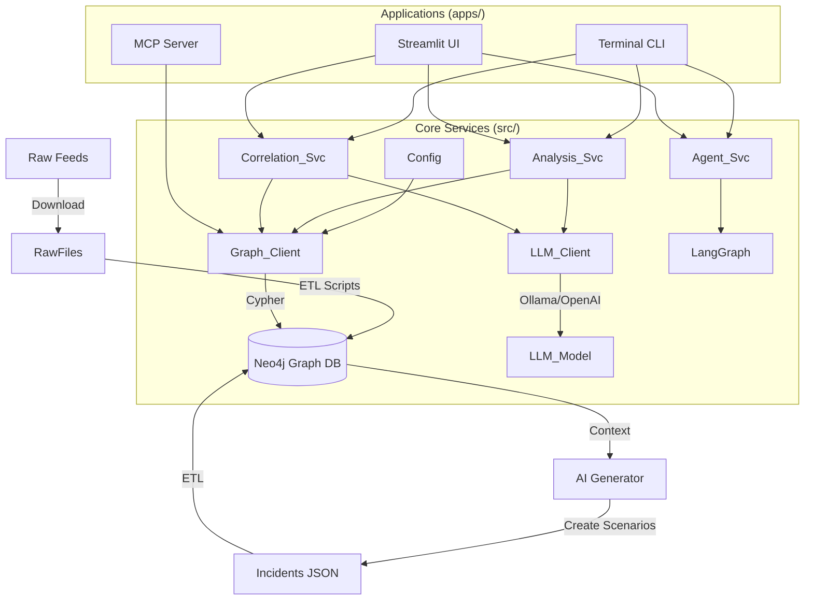

# 🛡️ Cyber Threat Ontology Intelligence (COIN)

**A Next-Gen Threat Intelligence Platform powered by Knowledge Graphs and Autonomous AI Agents.**

This project structures fragmented cyber threat data (IOCs, TTPs, CVEs) into a machine-readable **Knowledge Graph (Neo4j)**. By integrating a **Graph Database** with **LLMs (via LangChain/LangGraph)**, it provides deep analysis, hidden correlation discovery, an autonomous reasoning agent that answers complex security questions, and a simulation engine for attack scenarios.

---

## ✨ Key Features

### 1. 🕸️ Graph-Based Threat Modeling

* **Property Graph Model**: Structures data into nodes and relationships (`:Incident`, `:Malware`, `:ThreatGroup`, `:Vulnerability`, `:AttackStep`) using **Neo4j**.
* **Data Integration**: Ingests and normalizes data from disparate sources:
* **MITRE ATT&CK** (Tactics & Techniques)
* **CISA KEV** (Exploited Vulnerabilities)
* **URLhaus** (Malicious URLs/Payloads)


### 2. 🎞️ AI-Driven Scenario Generation & Explorer

* **Synthetic Incident Generation**: Uses LLMs to generate realistic cyber attack scenarios based on real-world threat intelligence.
* **Interactive Graph Explorer**: A "Cyberpunk" styled dynamic graph interface to explore:
* **Full Kill Chain**: Visualize the step-by-step attack flow.
* **Recursive Expansion**: Click on artifacts to uncover related incidents and threat actors.
* **Timeline Analysis**: Detailed chronological breakdown of the attack.


### 3. 🧠 Autonomous Reasoning Agent

* **LangGraph Integration**: Uses ReAct (Reason+Act) pattern to autonomously inspect the schema, write **Cypher** queries, and self-correct errors.
* **Context-Aware**: Remembers conversation history and context using optimized LLM context windows.

### 4. 🔍 Deep & Correlation Analysis

* **Entity Profiling**: Detailed analysis of specific Incidents or Malware using Graph Traversal.
* **Multi-hop Correlation**: Traces indirect relationships (e.g., "Do these two different IPs share a common attack technique or malware family?").

### 5. 🖥️ Multi-Interface Support

* **Streamlit UI**: A comprehensive web dashboard for visual analysis, agent interaction, and scenario exploration.
* **Interactive CLI**: A lightweight terminal interface for quick queries.
* **MCP Server**: Supports **Model Context Protocol**, allowing integration with AI clients like Claude Desktop.

---

## 🏗️ Architecture

The system follows a modular architecture separating the Core Logic, Services, and Application Layers.



---

## 📂 Directory Structure

```text
cyber-ontology/
├── apps/                 # Application Entry Points
│   ├── cli/              # Interactive Command-Line Interface
│   ├── ui/               # Streamlit Web Dashboard
│   │   └── pages/        # Deep Analysis, Correlation, Scenario Explorer
│   └── mcp/              # Model Context Protocol Server
├── src/                  # Core Business Logic
│   ├── core/             # Configuration, Neo4j Client & LLM Wrappers
│   └── services/         # Analysis, Correlation, Agent Logic
├── data/                 # Data Storage
│   ├── raw/              # Raw downloads (MITRE, KEV, URLHaus)
│   ├── generated/        # AI-generated incident scenarios
│   └── processed/        # Normalized JSON files for ETL
├── scripts/              # Setup & Data Processing Scripts
│   ├── etl/              # Knowledge Graph Loaders (ETL)
│   │   ├── preprocess_kev.py       # CISA KEV -> Neo4j
│   │   ├── preprocess_mitre.py     # MITRE ATT&CK -> Neo4j
│   │   ├── preprocess_urlhaus.py   # URLHaus -> Neo4j
│   │   └── process_incidents.py    # Generated Incidents -> Neo4j
│   ├── setup/            # Initial Setup & Generators
│   │   ├── download_*.sh           # Data Downloaders
│   │   ├── init_db.py              # Neo4j Constraints/Indexes Setup
│   │   └── generate_incidents.py   # AI Scenario Generator
│   └── setup_pipeline.sh # 🚀 Master Setup Script
├── .streamlit/           # Streamlit Theme Configuration
├── .env                  # Environment Variables
├── requirements.txt      # Python Dependencies
└── README.md             # Documentation
```

---

## 🚀 Getting Started

### Prerequisites

* **Python 3.10+**
* **Docker** (for running Neo4j container)
* **Ollama** (for local LLM) or OpenAI API Key

### 1. Environment Setup

```bash
# Clone the repository
git clone https://github.com/your-username/cyber-ontology.git
cd cyber-ontology

# Create virtual environment
python -m venv .venv
source .venv/bin/activate  # Windows: .venv\Scripts\activate

# Install dependencies
pip install -r requirements.txt
```

### 2. Configuration (`.env`)

Create a `.env` file in the project root:

```ini
# --- Neo4j Database Settings ---
NEO4J_URI=bolt://localhost:7687
NEO4J_USERNAME=neo4j
NEO4J_PASSWORD=your_password

# --- LLM Settings (Choose 'ollama' or 'openai') ---
LLM_PROVIDER=ollama

# Ollama Config
OLLAMA_BASE_URL=http://localhost:11434
OLLAMA_MODEL=llama3.1
OLLAMA_NUM_CTX=16384

# OpenAI Config (Optional)
# OPENAI_API_KEY=sk-proj-...
# OPENAI_MODEL=gpt-4o
```

### 3. Database Setup (Neo4j)

**Option A: Docker Run**

```bash
docker run -d \
  --name neo4j-coin \
  -p 7474:7474 -p 7687:7687 \
  -e NEO4J_AUTH=neo4j/your_password \
  neo4j:latest
```

**Option B: Docker Compose**

```bash
docker-compose up -d
```

Access the Neo4j Browser at `http://localhost:7474`.

### 4. Data Pipeline Execution (Recommended)

We provide a **master script** to handle the entire data pipeline in the correct order:

1. Initialize DB Constraints.
2. Download Raw Feeds (MITRE, KEV, URLHaus).
3. Build **Base Knowledge Graph**.
4. Generate **Synthetic Incidents** using LLM.
5. Ingest Incidents into the Graph.

```bash
# Give execution permission
chmod +x scripts/setup_pipeline.sh

# Run the full pipeline
./scripts/setup_pipeline.sh
```

> **Note:** Ensure your LLM provider (Ollama) is running before executing step 4, as incident generation requires LLM inference.

---

## 🖥️ Usage

### 1. Streamlit Web Dashboard (Recommended)

The most comprehensive interface with visualizations.

```bash
streamlit run apps/ui/Home.py
```

* **Deep Analysis**: Profile specific entities.
* **Correlation**: Find hidden links between artifacts.
* **Smart Agent**: Chat with the autonomous AI agent (Text-to-Cypher).
* **Scenario Explorer**: Interactive graph visualization of attack kill chains.

### 2. Interactive CLI

A fast, lightweight terminal tool.

```bash
python apps/cli/main.py
```

### 3. Model Context Protocol (MCP) Server

To use this ontology with **Claude Desktop** or other MCP clients:

Add this to your Claude Desktop config (`claude_desktop_config.json`):

```json
{
  "mcpServers": {
    "cyber-ontology": {
      "command": "/path/to/your/venv/bin/python",
      "args": ["/path/to/cyber-ontology/apps/mcp/server_neo4j.py"]
    }
  }
}
```

---

## Roadmap

* [x] Migration from Fuseki (RDF) to Neo4j (Property Graph)
* [x] Synthetic Incident Generation Pipeline
* [x] Interactive Scenario Explorer (Streamlit-Agraph)
* [x] Autonomous Agent (Text-to-Cypher)
* [ ] **Unstructured Data Processing (PDF/HTML Reports to Graph)**
* [ ] Automated TTP mapping from CTI reports
* [ ] Time-series analysis for campaign tracking